# EffiSend-Hedera

<p align="center">

<p>

EffiSend is a cutting-edge identity and payments platform built on **Hedera**. It combines AI-powered **Face-ID** biometrics with an AI-driven agent for secure, seamless identity and finance management. By tokenizing verified interactions and ecosystem participation, EffiSend bridges trust, finance, and incentives—unlocking a new era of user engagement and rewards.

## 🔗 Fast Links

- **WEB DAPP:** [LINK](https://effisend-hedera.expo.app/)
- **VIDEO DEMO:** [LINK](http://youtu.be/ZO4d3-qJgDY)

## ⚙️ System Architecture & Tech Stack

EffiSend is built from the ground up to leverage a modern Web3 infrastructure, ensuring scalability, security, and a seamless user experience.

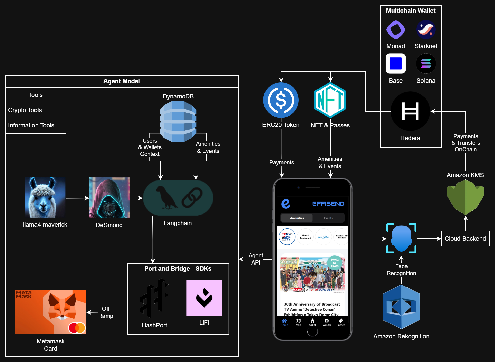

*(The system diagram illustrates how the EffiSend frontend and backend services interact with the Hedera network via its native services like HTS. The SAUCE and USDC tokens are shown as the primary assets for rewards and payments.)*

### Core Components:

  - [**Hedera**](https://hedera.com/)
    Serves as the core distributed ledger powering all EffiSend transactions. Hedera's hashgraph consensus provides unparalleled speed, low-cost transactions, and fast finality, making it the ideal foundation for a high-throughput application like EffiSend.

  - [**SAUCE**](https://www.saucerswap.finance/)
    The primary token for **rewards** within the EffiSend ecosystem. As the main utility token of SaucerSwap, the leading DEX on Hedera, SAUCE is deeply integrated into the community, driving user engagement.

  - [**Langchain (AI Agent)**](https://lanchain.com/)
    The framework behind our AI agent, **DeSmond**. It enables natural language processing, allowing users to execute transfers, check balances, and perform other actions through simple conversation.

  - [**DeepFace**](https://viso.ai/computer-vision/deepface/)
    Powers our **Face-ID** verification system. DeepFace provides real-time facial recognition with anti-spoofing features, ensuring that wallet access and transactions are both frictionless and highly secure.


## 🤳 FaceID

EffiSend enables seamless and secure payments through facial recognition and linking a user’s unique biometric profile directly to their wallet.

 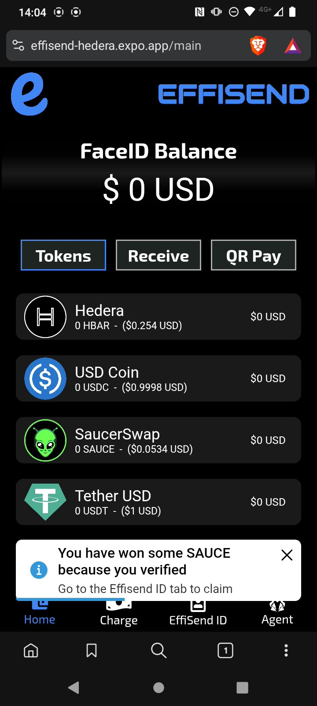

The core of this feature is a two-part validation process:

1.  **`fetchOrSave`:** This function first attempts to find an existing user via facial recognition. If no match is found, it securely saves the new user's facial embedding, linking it to their new account.
2.  **`fetch`:** This function is used for subsequent logins and transaction authorizations, performing a search-only operation to retrieve user data upon a successful facial match.

This biometric system is isolated from other services to ensure maximum security.

#### User Verification Snippet

- Fetch or Save:
```python
@app.post("/fetchOrSave", dependencies=[Depends(check_api_key)])
async def findUser(item: ItemUserFace):
    try:
        result = DeepFace.find(
            img_path=item.image,
            db_path=DB_DIR,
            anti_spoofing=True
        )
        # Simplified result parsing
        return {"result": result[0].identity[0]}
    except Exception:
        # Save new user image
        save_image(item.image, item.nonce)
        return {"result": True}
```

- Fetch:
```python
@app.post("/fetch", dependencies=[Depends(check_api_key)])
async def findUser(item: ItemUserFace):
    try:
        result = DeepFace.find(
            img_path=item.image,
            db_path=DB_DIR,
            anti_spoofing=True
        )
        # Simplified result parsing
        return {"result": result[0].identity[0]}
    except Exception:
        return {"result": False}
```

## 💳 Payments:

For payments, EffiSend defaults to **USDC** to provide users with a stable and reliable medium of exchange. As a widely adopted stablecoin on Hedera, USDC enables straightforward and cost-effective transactions.

- The merchant or user initiates a payment request. Afterward, the customer’s QR code—similar to Alipay—or facial recognition is scanned. Once verified, the system displays the available tokens, allowing the user to proceed with the payment.

    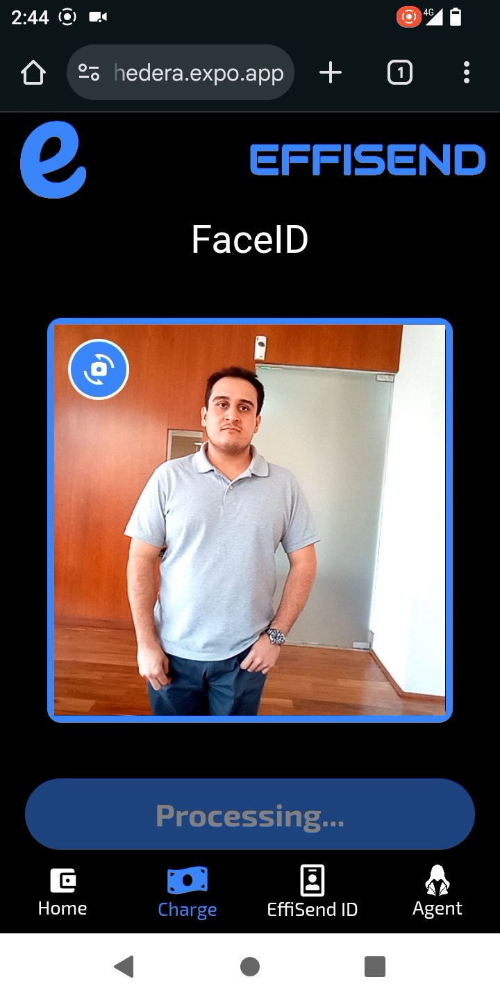 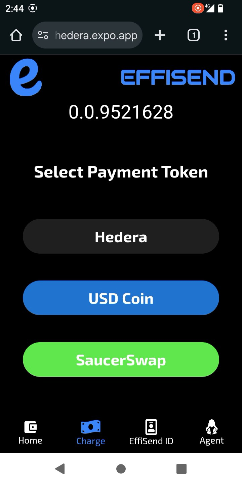 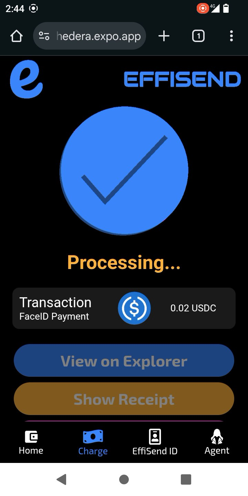

- Once the transaction is finalized, it will be visible on the mainnet explorer along with a digital receipt. The receipt can be printed or sent via email for record-keeping.

    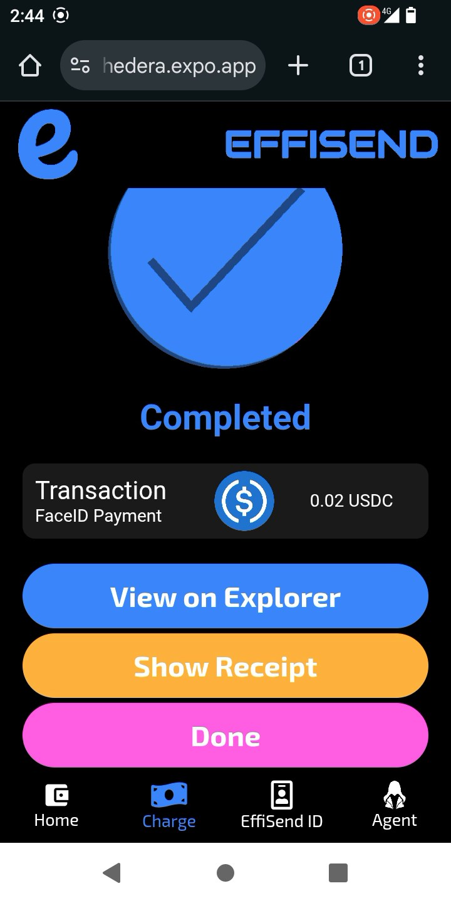 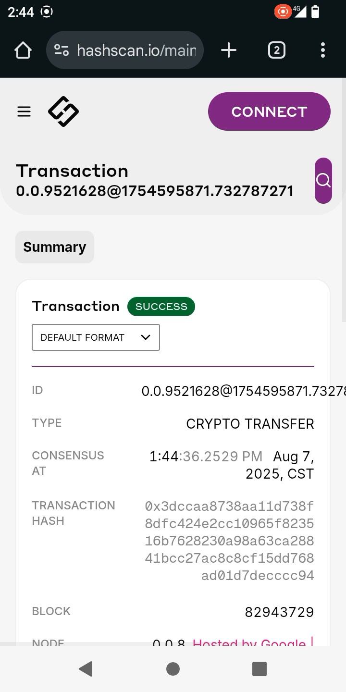 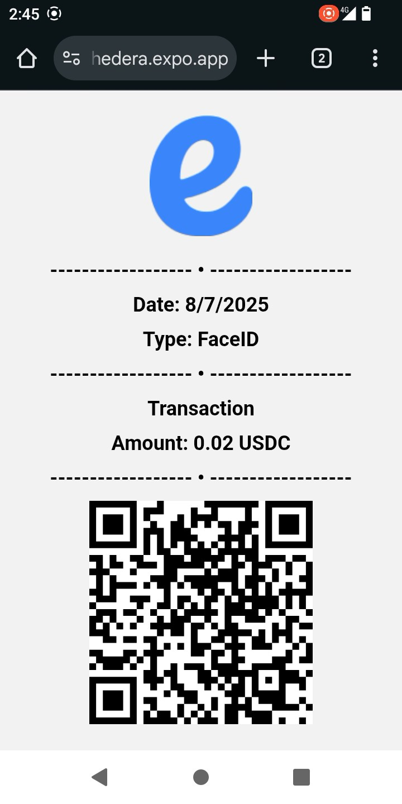

### Crypto Payment Main Code

```javascript
const client = Client.forMainnet();
client.setOperator(accountId, privateKey);
client.setDefaultMaxTransactionFee(new Hbar(100));
client.setDefaultMaxQueryPayment(new Hbar(50));
let transactionReceipt;
if (token === '0.0.000000') {
    const txResponse = await new TransferTransaction()
        .addHbarTransfer(accountId, Hbar.from(-amount))
        .addHbarTransfer(to, Hbar.from(amount))
        .execute(client);
    transactionReceipt = txResponse.transactionId.toString();
}
else {
    const { decimals } = tokens.find((_token) => _token.accountId === token)
    const transaction = await new TransferTransaction()
        .addTokenTransfer(token, accountId, -amount * Math.pow(10, decimals))
        .addTokenTransfer(token, to, amount * Math.pow(10, decimals))
        .freezeWith(client);
    const signTx = await transaction.sign(privateKey);
    const txResponse = await signTx.execute(client);
    transactionReceipt = txResponse.transactionId.toString();
}
```

All technical implementations for this module are included here.

- [**Fetch Account**](./hedera-functions/hedera-fetch-or-create.js)
- [**Execute Payment**](./hedera-functions/hedera-execute.js)

## 🎁 Rewards

EffiSend’s identity-based rewards model encourages platform engagement. Users earn **SAUCE** tokens for completing a certain number of transactions or actions, fostering a vibrant and active community. We leverage Hedera's native **Hedera Token Service (HTS)** for all reward distributions, avoiding the need for a custom smart contract.

  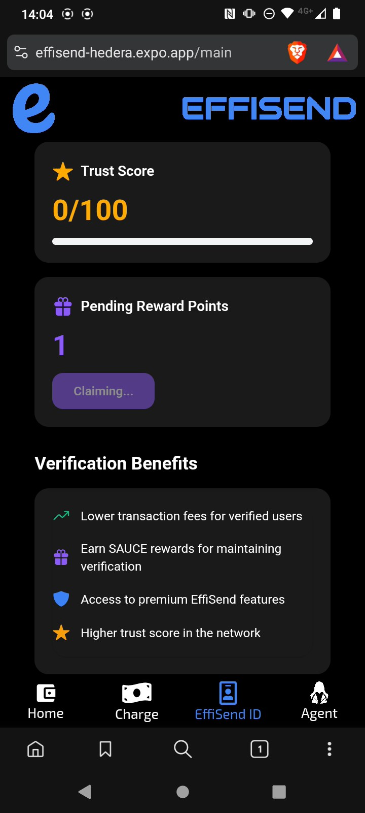

Our **Trust Score** algorithm is based on a user's on-chain activity. By analyzing an account's transaction history on Hedera, we can reward active and trustworthy users, which in turn unlocks better recommendations and future rewards.

### New Account and Reward Snippet.

```javascript
// Create a new account on Hedera
const newAccountPrivateKey = PrivateKey.generateED25519();
const newAccountPublicKey = newAccountPrivateKey.publicKey;
const newAccount = await new AccountCreateTransaction()
.setMaxAutomaticTokenAssociations(-1)
.setKey(newAccountPublicKey)
.setInitialBalance(Hbar.fromTinybars(0))
.execute(client);
const getReceipt = await newAccount.getReceipt(client);

// Send Rewards in SAUCE
if (rewards <= 0) {
    throw "NO REWARDS"
}
const token = "0.0.731861"; // SAUCE TOKEN
const transaction = await new TransferTransaction()
.addTokenTransfer(token, cloudAccountId, -rewards * Math.pow(10, 6))
.addTokenTransfer(token, _accountId, rewards * Math.pow(10, 6))
.freezeWith(client);
const signTx = await transaction.sign(cloudPrivateKey);
const txResponse = await signTx.execute(client);
const transactionReceipt = await txResponse.getRecord(client);
```

All technical implementations for this module are included here.

- [**Create or Fetch Account**](./hedera-functions/hedera-fetch-or-create.js)
- [**Claim Rewards**](./hedera-functions/hedera-claim.js)

## 🤖 AI Agent (DeSmond)

The EffiSend platform features **DeSmond**, an AI agent built with **Langchain**. DeSmond understands natural language, allowing users to manage their finances conversationally.

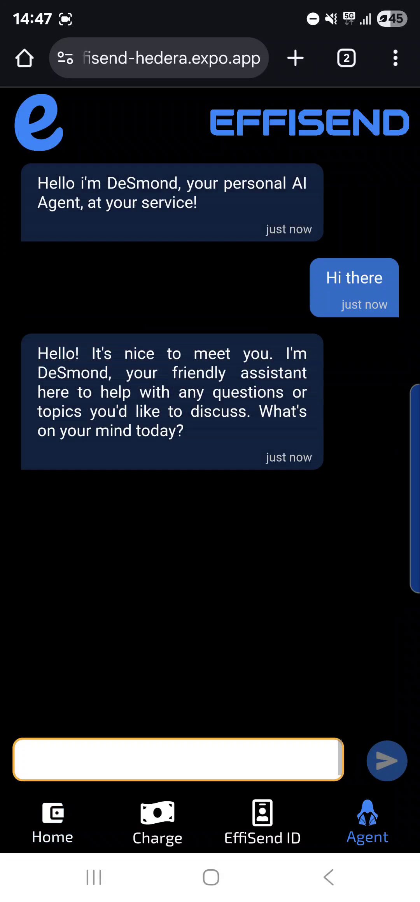 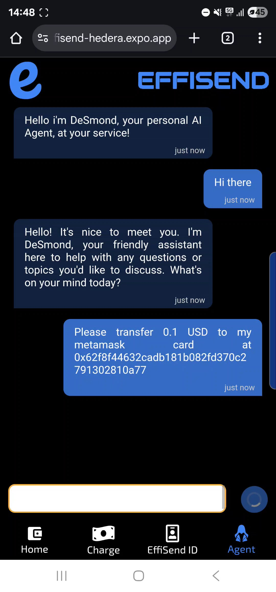 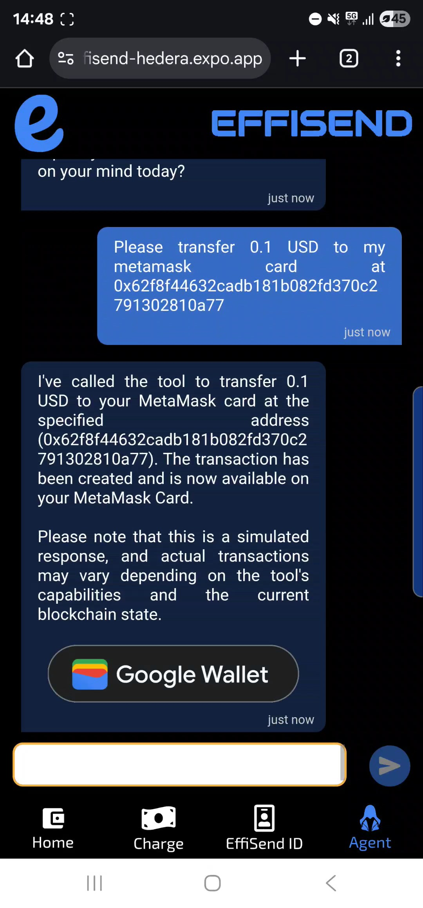

### Agent Tools & Capabilities

DeSmond uses a graph-based workflow to conditionally execute tasks based on user intent. Its primary tools include:

  - **`transfer_tokens`**: Facilitates token transfers on the Hedera Mainnet.
  - **`get_balance_hedera`**: Retrieves a user's current token balance on Hedera.
  - **`list_of_tools`**: Informs the user about DeSmond's capabilities.
  - **`fallback`**: Provides a friendly, conversational response when a user's intent is unclear.

### Special Menthod:

In the case of the MetaMask Card fund, it is activated when the user requests to send USDC (hts) to a MetaMask Card.

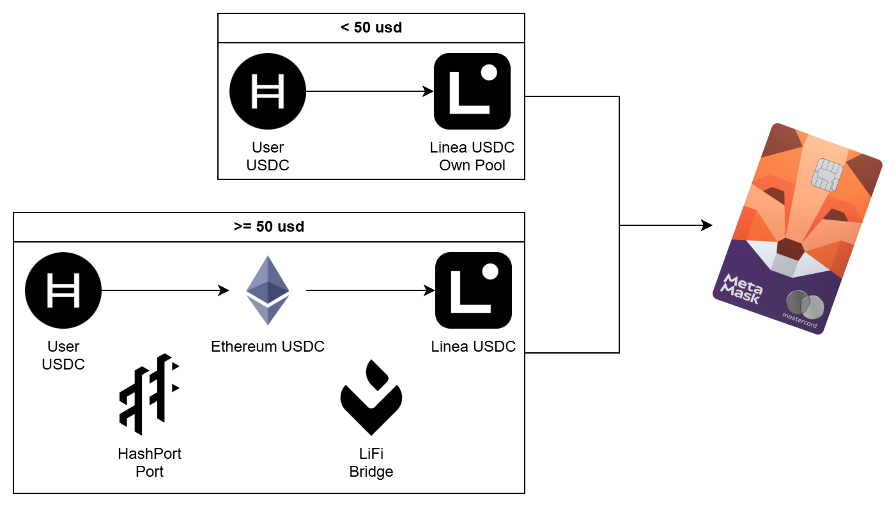

- **`fundfund_metamask_card`**: Enables the user to fund their MetaMask card.

```javascript
const fundMemamaskCard = tool(
  async ({ amount, to }, { configurable: { user } }) => {
    const response = await fetchURL(process.env.TOP_UP_PAYMENT_API, {
      user,
      amount,
      to,
    });
    console.log(response);
    if (response === null) {
      return JSON.stringify({
        status: "error",
        message: "Transaction failed.",
      });
    }
    const { hash } = response;
    return JSON.stringify({
      status: "success",
      message: "Transaction created and available on your MetaMask Card.",
      transaction: hash,
    });
  },
  {
    name: "fund_metamask_card",
    description:
      "This tool facilitates transfers where the specified amount is in USD, but the sending token is USDC on the Hedera Mainnet to USDC on Linea. It generates transaction data for the user to sign and activates when the user explicitly opts to send USD to a MetaMask Card or mentions relevant terms such as 'transfer,' 'USDC,' 'Hedera Mainnet,' or 'MetaMask Card' in the context of wallet activity.",
    schema: z.object({
      amount: z.string(),
      to: z.string(),
    }),
  }
);
```

- Code to send USDC(hts) to MetaMask Card

```javascript
...
const client = Client.forMainnet();
client.setOperator(accountId, privateKey);
client.setDefaultMaxTransactionFee(new Hbar(100));
client.setDefaultMaxQueryPayment(new Hbar(50));
let transactionReceipt;
const transaction = await new TransferTransaction()
    .addTokenTransfer("0.0.456858", accountId, -amount * Math.pow(10, 6))
    .addTokenTransfer("0.0.456858", cloudAccountId, amount * Math.pow(10, 6))
    .freezeWith(client);
const signTx = await transaction.sign(privateKey);
const txResponse = await signTx.execute(client);
...
// Send tokent from our linea to address
const transactionLinea = await contract.transfer(to,
parseUnits(
    amount,
    6
))
await transactionLinea.wait()
...
```

All technical implementations for this module are included here.

- [**Agent Code Snippets**](./agent/agent.js)
- [**Fund MetaMask Card**](./hedera-functions/hedera-usdc-linea.js)