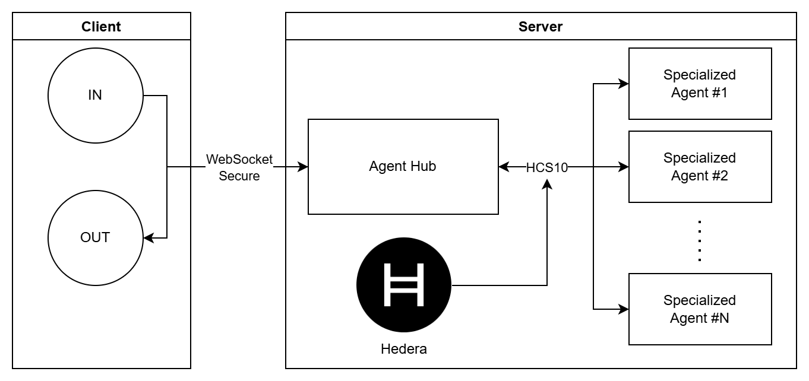

# EffiSend-Hedera

<p align="center">

<p>

EffiSend is a cutting-edge identity and payments platform built on **Hedera**. It combines AI-powered **Face-ID** biometrics with an AI-driven agent for secure, seamless identity and finance management. By tokenizing verified interactions and ecosystem participation, EffiSend bridges trust, finance, and incentives—unlocking a new era of user engagement and rewards.

## 🔗 Fast Links

- **WEB DAPP:** [LINK](https://effisend-hedera.expo.app/)
- **VIDEO DEMO:** [LINK](http://youtu.be/ZO4d3-qJgDY)

## ⚙️ System Architecture & Tech Stack

EffiSend is built from the ground up to leverage a modern Web3 infrastructure, ensuring scalability, security, and a seamless user experience.


*(The system diagram illustrates how the EffiSend frontend and backend services interact with the Hedera network via its native services like HTS. The SAUCE and USDC tokens are shown as the primary assets for rewards and payments.)*

### Core Components:

  - [**Hedera**](https://hedera.com/)
    Serves as the core distributed ledger powering all EffiSend transactions. Hedera's hashgraph consensus provides unparalleled speed, low-cost transactions, and fast finality, making it the ideal foundation for a high-throughput application like EffiSend.

  - [**SAUCE**](https://www.saucerswap.finance/)
    The primary token for **rewards** within the EffiSend ecosystem. As the main utility token of SaucerSwap, the leading DEX on Hedera, SAUCE is deeply integrated into the community, driving user engagement.

  - [**Langchain (AI Agent)**](https://lanchain.com/)
    The framework behind our AI agent, **DeSmond**. It enables natural language processing, allowing users to execute transfers, check balances, and perform other actions through simple conversation.

  - [**DeepFace**](https://viso.ai/computer-vision/deepface/)
    Powers our **Face-ID** verification system. DeepFace provides real-time facial recognition with anti-spoofing features, ensuring that wallet access and transactions are both frictionless and highly secure.


## 🤳 FaceID

EffiSend enables seamless and secure payments through facial recognition and linking a user’s unique biometric profile directly to their wallet.

 

The core of this feature is a two-part validation process:

1.  **`fetchOrSave`:** This function first attempts to find an existing user via facial recognition. If no match is found, it securely saves the new user's facial embedding, linking it to their new account.
2.  **`fetch`:** This function is used for subsequent logins and transaction authorizations, performing a search-only operation to retrieve user data upon a successful facial match.

This biometric system is isolated from other services to ensure maximum security.

#### User Verification Snippet

- Fetch or Save:
```python
@app.post("/fetchOrSave", dependencies=[Depends(check_api_key)])
async def findUser(item: ItemUserFace):
    try:
        result = DeepFace.find(
            img_path=item.image,
            db_path=DB_DIR,
            anti_spoofing=True
        )
        # Simplified result parsing
        return {"result": result[0].identity[0]}
    except Exception:
        # Save new user image
        save_image(item.image, item.nonce)
        return {"result": True}
```

- Fetch:
```python
@app.post("/fetch", dependencies=[Depends(check_api_key)])
async def findUser(item: ItemUserFace):
    try:
        result = DeepFace.find(
            img_path=item.image,
            db_path=DB_DIR,
            anti_spoofing=True
        )
        # Simplified result parsing
        return {"result": result[0].identity[0]}
    except Exception:
        return {"result": False}
```

## 💳 Payments:

For payments, EffiSend defaults to **USDC** to provide users with a stable and reliable medium of exchange. As a widely adopted stablecoin on Hedera, USDC enables straightforward and cost-effective transactions.

- The merchant or user initiates a payment request. Afterward, the customer’s QR code—similar to Alipay—or facial recognition is scanned. Once verified, the system displays the available tokens, allowing the user to proceed with the payment.

      

- Once the transaction is finalized, it will be visible on the mainnet explorer along with a digital receipt. The receipt can be printed or sent via email for record-keeping.

      

### Crypto Payment Main Code

```javascript
const client = Client.forMainnet();
client.setOperator(accountId, privateKey);
client.setDefaultMaxTransactionFee(new Hbar(100));
client.setDefaultMaxQueryPayment(new Hbar(50));
let transactionReceipt;
if (token === '0.0.000000') {
    const txResponse = await new TransferTransaction()
        .addHbarTransfer(accountId, Hbar.from(-amount))
        .addHbarTransfer(to, Hbar.from(amount))
        .execute(client);
    transactionReceipt = txResponse.transactionId.toString();
}
else {
    const { decimals } = tokens.find((_token) => _token.accountId === token)
    const transaction = await new TransferTransaction()
        .addTokenTransfer(token, accountId, -amount * Math.pow(10, decimals))
        .addTokenTransfer(token, to, amount * Math.pow(10, decimals))
        .freezeWith(client);
    const signTx = await transaction.sign(privateKey);
    const txResponse = await signTx.execute(client);
    transactionReceipt = txResponse.transactionId.toString();
}
```

All technical implementations for this module are included here.

- [**Fetch Account**](./hedera-functions/hedera-fetch-or-create.js)
- [**Execute Payment**](./hedera-functions/hedera-execute.js)

## 🎁 Rewards

EffiSend’s identity-based rewards model encourages platform engagement. Users earn **SAUCE** tokens for completing a certain number of transactions or actions, fostering a vibrant and active community. We leverage Hedera's native **Hedera Token Service (HTS)** for all reward distributions, avoiding the need for a custom smart contract.

  

Our **Trust Score** algorithm is based on a user's on-chain activity. By analyzing an account's transaction history on Hedera, we can reward active and trustworthy users, which in turn unlocks better recommendations and future rewards.

### New Account and Reward Snippet.

```javascript
// Create a new account on Hedera
const newAccountPrivateKey = PrivateKey.generateED25519();
const newAccountPublicKey = newAccountPrivateKey.publicKey;
const newAccount = await new AccountCreateTransaction()
.setMaxAutomaticTokenAssociations(-1)
.setKey(newAccountPublicKey)
.setInitialBalance(Hbar.fromTinybars(0))
.execute(client);
const getReceipt = await newAccount.getReceipt(client);

// Send Rewards in SAUCE
if (rewards <= 0) {
    throw "NO REWARDS"
}
const token = "0.0.731861"; // SAUCE TOKEN
const transaction = await new TransferTransaction()
.addTokenTransfer(token, cloudAccountId, -rewards * Math.pow(10, 6))
.addTokenTransfer(token, _accountId, rewards * Math.pow(10, 6))
.freezeWith(client);
const signTx = await transaction.sign(cloudPrivateKey);
const txResponse = await signTx.execute(client);
const transactionReceipt = await txResponse.getRecord(client);
```

All technical implementations for this module are included here.

- [**Create or Fetch Account**](./hedera-functions/hedera-fetch-or-create.js)
- [**Claim Rewards**](./hedera-functions/hedera-claim.js)

## 🤖 AI Agent Hub (DeSmond)

EffiSend has evolved from a single AI agent to a **multi-agent hub architecture** powered by **HCS10** (Hedera Consensus Service 10). This upgrade enables specialized agents to collaborate securely via Hedera's consensus layer, providing users with enhanced capabilities through natural conversation.

  

### Multi-Agent Architecture

The system consists of three key components:



- **Agent Hub**: Central coordinator that receives user requests via WebSocket and routes them to specialized agents through HCS10
- **Specialized Agents**: Individual AI agents (like DeSmond) with domain-specific tools and capabilities
- **HybridEncryption Library**: Custom RSA + AES-256-GCM encryption ensuring secure, tamper-proof communication between all agents

### Communication Flow

The multi-agent system operates through a secure, four-step communication pipeline:

#### 1. Client Layer (WebSocket Connection)

The client establishes a WebSocket connection to the Agent Hub and sends user messages with contextual information.

```javascript
// Initialize WebSocket connection
ws.current = new WebSocket(process.env.EXPO_PUBLIC_HCS10_AGENT_URL);

// Send user message with context
async function chatWithAgent(message) {
  const user = await getEncryptedStorageValue("user");
  const raw = JSON.stringify({
    message,
    context: {
      accountId: context.value.accountId,
      user,
    },
  });
  if (ws.current && ws.current.readyState === WebSocket.OPEN) {
    ws.current.send(raw);
  }
}

// Receive and display agent response
ws.current.onmessage = (e) => {
  const response = JSON.parse(e.data);
  // Update UI with agent's message and tool used
  chatHistory.push({
    message: response.message,
    type: "system",
    tool: response.last_tool,
  });
};
```

**Reference:** [tab4.js](./agent/Client/tab4.js)

#### 2. Agent Hub (Request Router & Encryptor)

The hub receives WebSocket messages, generates unique request IDs, encrypts payloads using HybridEncryption, and forwards them to the appropriate specialized agent via HCS10.

```javascript
// Generate unique request ID for tracking
const requestId = guid();
pendingRequests.set(requestId, clientId);

// Encrypt and send to specialized agent via HCS
await handler.sendMessage(
  {
    requestId: requestId,
    text: JSON.parse(textMessage),
    from: MY_ACCOUNT_ID,
  },
  AGENT1_ACCOUNT_ID
);

// Listen for encrypted responses from agents
handler.on("messageReceived", (event) => {
  const { message, senderId } = event;
  
  // Route response back to original client
  if (message.requestId && pendingRequests.has(message.requestId)) {
    const wsId = pendingRequests.get(message.requestId);
    const ws = idToWs.get(wsId);
    
    delete message.requestId;
    ws.send(JSON.stringify(message));
    pendingRequests.delete(message.requestId);
  }
});
```

**Reference:** [Agent Hub/index.js](./agent/Agent%20Hub/index.js)

#### 3. Specialized Agent (AI Processing & Tool Execution)

The agent receives encrypted messages via HCS10, decrypts them, processes the request using LangGraph with specialized tools, and sends the encrypted response back to the hub.

```javascript
// Decrypt incoming HCS message
handler.on("messageReceived", async (processedMessage) => {
  const { senderId, message } = processedMessage;
  const { text: { message: userMessage, context }, requestId } = message;
  
  // Process with LangGraph workflow
  const agentResponse = await invokeAgent(userMessage, context, graph);
  
  // Send encrypted response back to hub with original requestId
  const replyPayload = {
    ...agentResponse,
    requestId: requestId,
  };
  
  await handler.sendMessage(replyPayload, senderId);
});

// LangGraph workflow execution
async function invokeAgent(message, contextData, graph) {
  const input = setInput(message);
  const context = config(contextData);
  
  const output = await graph.invoke(input, context);
  const finalMessage = output.messages[output.messages.length - 1];
  const tool = output.messages[2]?.["tool_calls"]?.[0]?.name ?? null;
  
  return { status: "success", message: finalMessage.content, last_tool: tool };
}
```

**Reference:** [AgentN/index.js](./agent/AgentN/index.js)

### Custom Encryption & Communication Library

At the core of the multi-agent system is a **custom-built encryption and communication library** developed from scratch specifically for secure agent-to-agent messaging over HCS10. This library consists of two main components:

#### HybridEncryption Class

A production-ready encryption utility that combines the best of asymmetric and symmetric cryptography:

**Key Features:**
- **RSA-2048 + AES-256-GCM**: Uses RSA for secure key exchange and AES-GCM for fast data encryption with authentication
- **Type Preservation**: Automatically serializes and deserializes data types (strings, objects, arrays, primitives)
- **Authentication Tags**: Ensures data integrity and prevents tampering with GCM authentication
- **Key Management**: Built-in utilities for generating, loading, and saving RSA key pairs

```javascript
// Encryption: Automatically handles any data type
const encrypted = HybridEncryption.encrypt(
  { message: "Transfer 100 USDC", amount: 100 },
  recipientPublicKey
);

// Decryption: Returns original data type
const decrypted = HybridEncryption.decrypt(encrypted, myPrivateKey);
// Result: { message: "Transfer 100 USDC", amount: 100 }

// Key pair generation
const { publicKey, privateKey } = HybridEncryption.generateKeyPair(2048);
```

#### AgentCommunicationHandler Class

An event-driven handler that manages HCS10 message monitoring, encryption/decryption, and agent authorization:

**Key Features:**
- **Event-Based Architecture**: Extends EventEmitter for reactive message handling
- **Automatic Monitoring**: Continuously polls HCS topics for new messages with timestamp tracking
- **Authorization Control**: Whitelist-based system to restrict communication to trusted agents
- **Seamless Integration**: Works directly with HCS10Client for Hedera consensus

```javascript
// Initialize handler with encryption keys and authorized agents
const handler = new AgentCommunicationHandler(
  hcsClient,
  CONNECTION_TOPIC_ID,
  MY_ACCOUNT_ID,
  myPrivateKey,
  { [AGENT_ID]: agentPublicKey },
  [AUTHORIZED_AGENT_1, AUTHORIZED_AGENT_2]
);

// Listen for decrypted messages
handler.on("messageReceived", (event) => {
  console.log(`From: ${event.senderId}`);
  console.log(`Message:`, event.message);
});

// Send encrypted message to another agent
await handler.sendMessage(
  { action: "transfer", amount: 100 },
  recipientAgentId
);

// Start monitoring HCS topic
await handler.monitorConnectionMessages();
```

**Reference:** [lib.js](./agent/Agent%20Hub/lib.js)

### Agent Capabilities

DeSmond uses a **LangGraph** state machine with specialized tools:

- **`transfer_tokens`**: Facilitates token transfers on Hedera Mainnet
- **`get_balance_hedera`**: Retrieves current token balances for any HTS token
- **`fund_metamask_card`**: Cross-chain USDC transfers from Hedera to Linea for MetaMask Card funding
- **`list_of_tools`**: Provides information about available capabilities
- **`fallback`**: Friendly conversational responses for general queries

### Special Feature: MetaMask Card Integration

When users request to fund their MetaMask Card, the agent executes a cross-chain transfer:


```javascript
// Transfer USDC from Hedera to Linea
const transaction = await new TransferTransaction()
    .addTokenTransfer("0.0.456858", accountId, -amount * Math.pow(10, 6))
    .addTokenTransfer("0.0.456858", cloudAccountId, amount * Math.pow(10, 6))
    .freezeWith(client);
const signTx = await transaction.sign(privateKey);
await signTx.execute(client);

// Bridge to Linea and fund MetaMask Card
const transactionLinea = await contract.transfer(to, parseUnits(amount, 6));
await transactionLinea.wait();
```

### Security & Scalability

- **End-to-End Encryption**: All agent communications use hybrid encryption (RSA-2048 + AES-256-GCM)
- **Decentralized Consensus**: HCS10 ensures message integrity and persistence on Hedera
- **Request Tracking**: Unique request IDs map responses back to originating clients
- **Extensible Design**: New specialized agents can be added without modifying existing infrastructure

All technical implementations for this module:

- [**Agent Hub**](./agent/Agent%20Hub/index.js)
- [**HybridEncryption Library**](./agent/Agent%20Hub/lib.js)
- [**Specialized Agent (DeSmond)**](./agent/AgentN/index.js)
- [**Client Chat Interface**](./agent/Client/tab4.js)
- [**Fund MetaMask Card**](./hedera-functions/hedera-usdc-linea.js)