# EffiSend-Hedera

<p align="center">
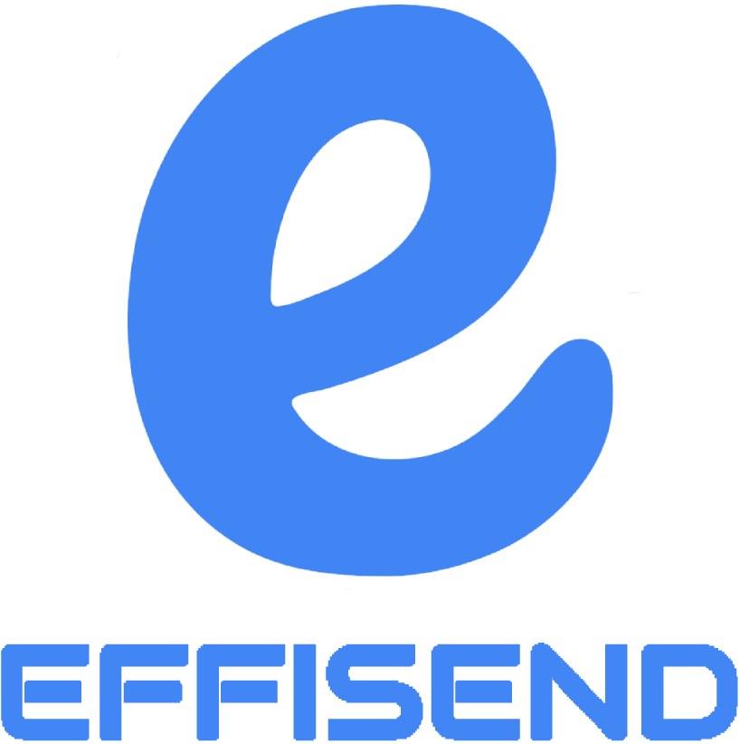
</p>

EffiSend is a cutting-edge identity, multichain wallet, and payments platform built on **Hedera**. It combines AI-powered **Face-ID** biometrics with an AI-driven agent for secure, seamless identity and finance management. By tokenizing verified interactions and ecosystem participation, EffiSend bridges trust, finance, and incentives—unlocking a new era of user engagement and rewards.

## 🔗 Fast Links

  - **WEB DAPP:** [LINK](https://effisend-tdc.expo.app/)
  - **PROOF OF ON-CHAIN ACTIVITY:** [LINK](https://hashscan.io/mainnet/account/0.0.9520271/operations)
  - **VIDEO DEMO:** [LINK](https://youtu.be/67Rny1j34eU)
  - **GET YOUR NFT:** [SECTION](#️-try-it-now-claim-your-exclusive-nft-pass)

## ⚙️ System Architecture & Tech Stack

EffiSend is built from the ground up to leverage a modern Web3 infrastructure combined with a serverless AWS backend, ensuring scalability, enterprise-grade security, and a seamless user experience for high-traffic venues like **Tokyo Dome City**.

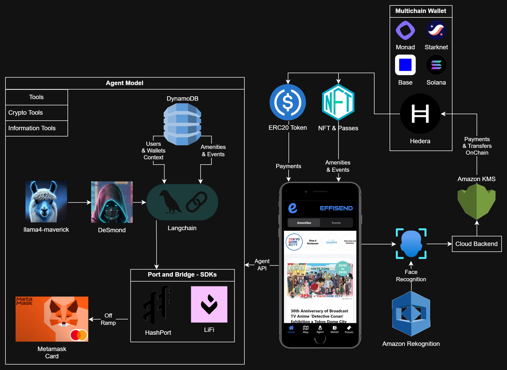

*(The system diagram illustrates how the EffiSend frontend and backend services interact with the Hedera network via its native services like HTS, while leveraging AWS for secure signing and biometric verification. The SAUCE and USDC tokens are shown as the primary assets for payments.)*

### Core Components:

  - [**Hedera**](https://hedera.com/)
    Serves as the core distributed ledger powering all EffiSend transactions. Hedera's hashgraph consensus provides unparalleled speed, low-cost transactions, and fast finality, making it the ideal foundation for a high-throughput application like EffiSend.

  - [**AWS KMS (Key Management Service)**](https://aws.amazon.com/kms/)
    Powers our enterprise-grade wallet security. Instead of storing raw private keys on the client, EffiSend uses AWS KMS to securely manage hardware-backed ECDSA keys. It signs Hedera transactions directly from our Lambda backend using a custom ECDSA\_SHA\_256 signer, ensuring private keys are never exposed.

  - [**AWS Rekognition**](https://aws.amazon.com/rekognition/)
    Drives our **Face-ID** verification system. AWS Rekognition provides highly accurate, real-time facial analysis and comparison, allowing users to securely link their **Tokyo Dome City passes** directly to their identity.

  - [**Tokyo Dome City Integration**](https://www.tokyo-dome.co.jp/en/tourists/)
    EffiSend is optimized for ecosystem engagement within Tokyo Dome City. Users can securely verify their identity via FaceID to link, manage, and display their passes and tickets directly within the app.

  - [**SAUCE**](https://www.saucerswap.finance/)
    The primary token for **rewards** within the EffiSend ecosystem. As the main utility token of SaucerSwap, the leading DEX on Hedera, SAUCE is deeply integrated into the community, driving user engagement.

  - [**LangChain (AI Agent)**](https://langchain.com/)
    The framework behind our AI agent, **DeSmond**. It enables natural language processing, allowing users to execute transfers, check balances, and perform complex workflows through simple conversation.

## 🤳 FaceID & Biometric Identity

EffiSend provides a frictionless, seedless onboarding experience by linking a user’s unique biometric profile directly to their **Hedera** account. This system is specifically optimized for high-traffic environments like **Tokyo Dome City**, allowing users to securely link and manage their event passes using only their face.

<p align="center">
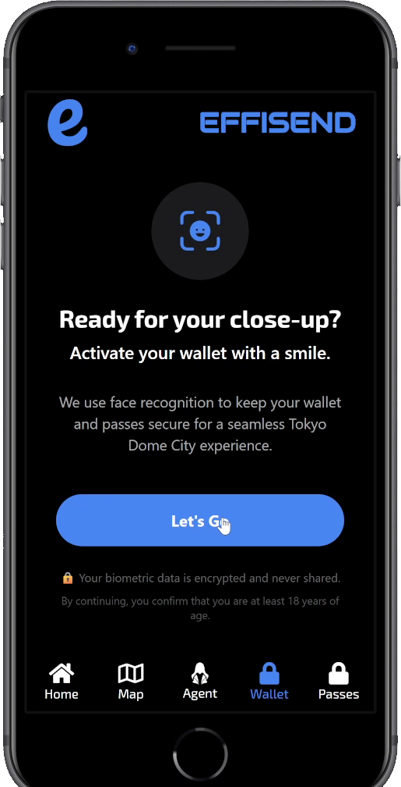 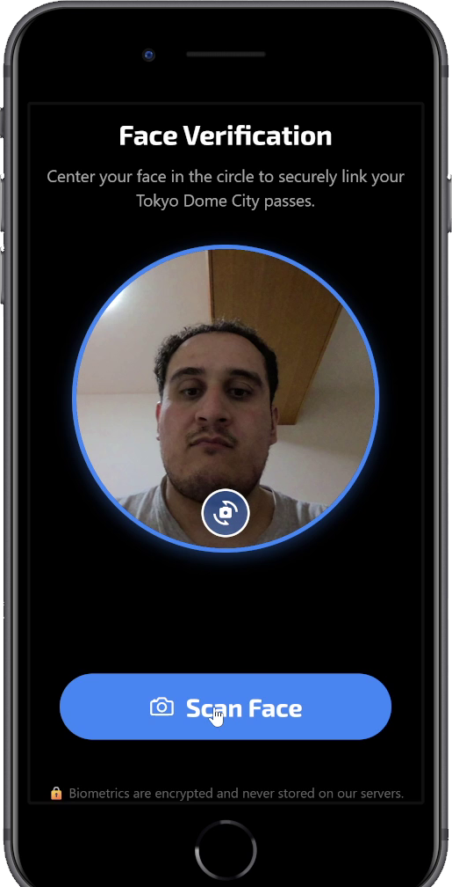 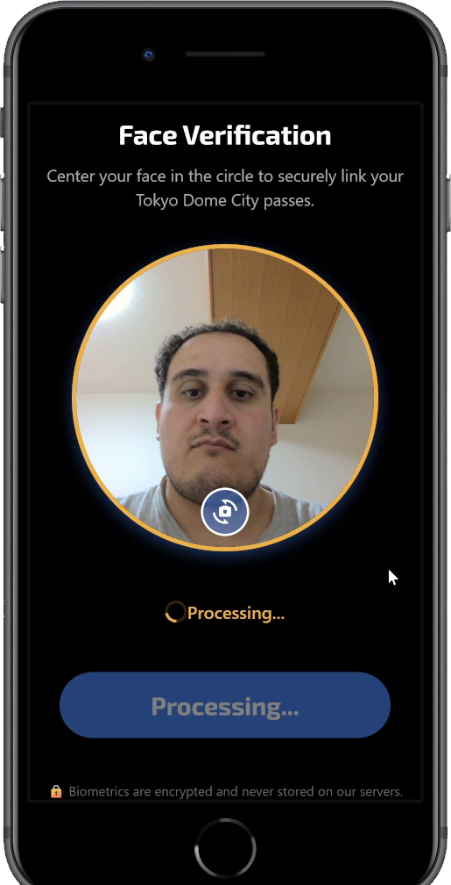
</p>

The core of this identity layer is powered by **AWS Rekognition**, which provides enterprise-grade facial analysis and anti-spoofing to ensure that wallet access and transaction authorizations are both frictionless and highly secure.

### Biometric Validation Process

The system utilizes a two-part validation workflow managed via a serverless AWS Lambda backend:

  * **`fetchOrSave`**: This endpoint first attempts to find an existing user within the **Effisend-Production-Face-DB** collection using a 90% confidence threshold. If no match is found, the system processes the image using **Jimp** for optimal resizing and securely indexes the new face, linking it to a unique **nonce** that serves as the user's permanent identity anchor.
  * **`fetch`**: Used for subsequent logins and high-security actions, such as payment authorizations. It performs a search-only operation to retrieve the matched identity; if no face is detected or no match is found, it returns a secure failure state.

### FaceID Implementation Snippet (AWS Lambda)

**Fetch or Save:**

```javascript
// Executing search against the biometric collection
const searchCommand = new SearchFacesByImageCommand({
  CollectionId: COLLECTION_ID,
  Image: { Bytes: resizedImageBytes },
  FaceMatchThreshold: 90,
  MaxFaces: 1
});

const searchResponse = await client.send(searchCommand);

// If no match is found, index the new face with a unique nonce
if (path === '/fetchOrSave' && !searchResponse.FaceMatches?.length) {
  const indexCommand = new IndexFacesCommand({
    CollectionId: COLLECTION_ID,
    Image: { Bytes: resizedImageBytes },
    ExternalImageId: nonce, // Linking biometric to user account
    MaxFaces: 1,
    QualityFilter: "HIGH"
  });
  await client.send(indexCommand);
}
```

**Fetch:**

```javascript
// Endpoint logic for secure verification (index.mjs)
if (path === '/fetch') {
  const searchCommand = new SearchFacesByImageCommand({
    CollectionId: COLLECTION_ID,
    Image: { Bytes: resizedImageBytes },
    FaceMatchThreshold: 90,
    MaxFaces: 1
  });

  const searchResponse = await client.send(searchCommand);

  if (searchResponse.FaceMatches && searchResponse.FaceMatches.length > 0) {
    const identity = searchResponse.FaceMatches[0].Face.ExternalImageId;
    return { 
      statusCode: 200, 
      body: JSON.stringify({ result: identity }) 
    };
  }
  return { 
    statusCode: 200, 
    body: JSON.stringify({ result: false }) 
  };
}
```

All the technical details can be found here:

  - [Rekognition Lambda Code](./amazonrekognition/index.js)

## 🌐 Unified Multichain Wallet Architecture

EffiSend is designed as a **chain-agnostic ecosystem** that abstracts the complexities of multiple protocols into a single, biometric-secured interface. While **Hedera** is the primary backbone, the wallet seamlessly manages assets across **Base**, **Monad**, **Starknet**, and **Solana**.

<p align="center">
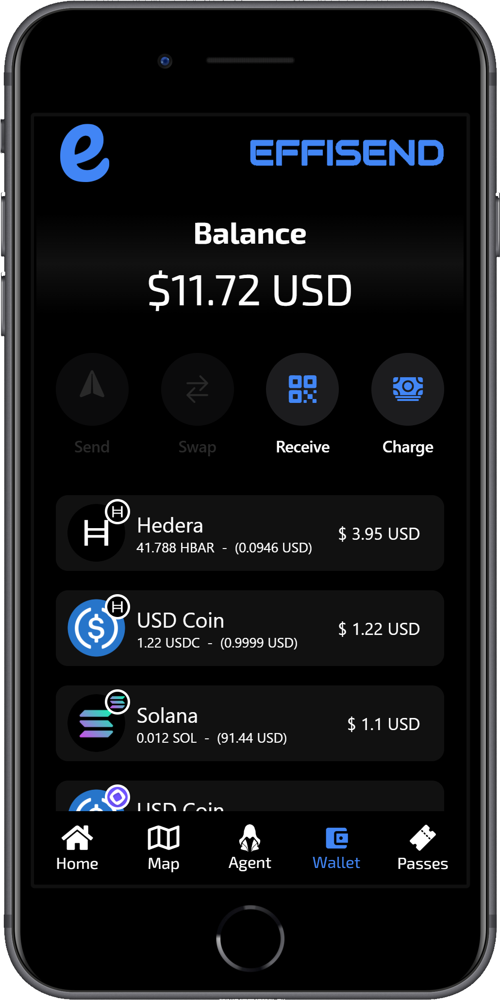 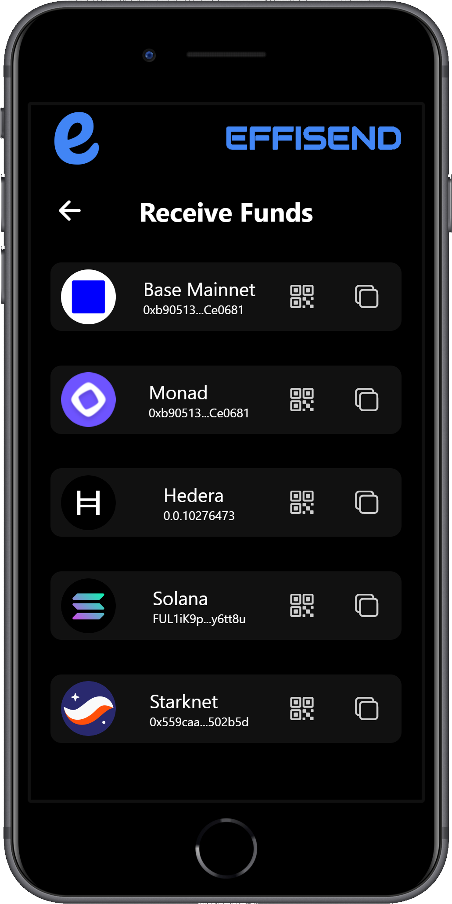 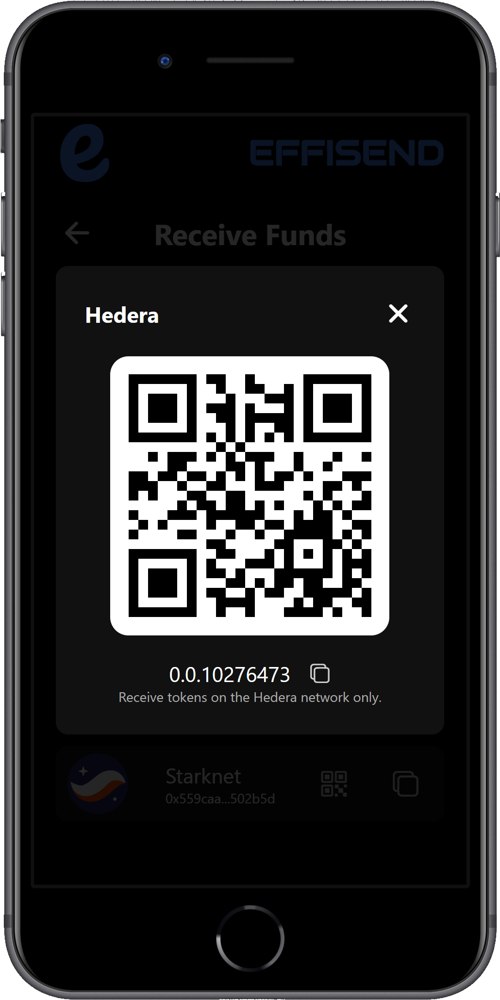
</p>

### Core Wallet Features:

  * **Modular Adapter Pattern**: Utilizes specialized adapters (`EVMChain`, `StarknetChain`, `HederaChain`, `SolanaChain`) for balance fetching and transaction signing.
  * **Real-Time Global Valuation**: Integrates the **CoinGecko API** to fetch live USD conversion rates for all supported tokens.
  * **Supported Networks**: Supports Hedera (HBAR, USDC, SAUCE), Base (ETH, USDC, cbBTC), Monad (MON, USDC), Starknet (ETH, STRK), and Solana (SOL, USDC, JUP).

### Multichain Balance Logic Snippet:

```javascript
// tab4.js - Aggregating balances across all chains
const balancesResult = await Promise.all(
  blockchains.map(async (chain) => {
    const address = addresses[chain.type];
    if (!address) return chain.tokens.map(() => 0);
    
    const Adapter = adapterMap[chain.type];
    const adapter = new Adapter(chain);
    const result = await adapter.getBalances(address);
    return result.map((x) => Number(x) || 0);
  })
);
```

All the technical details can be found here:

  - [Wallet Code](./effisend-hedera/src/app/(screens)/tabs/tab1.js)

## 💳 Payments & AWS KMS Security

EffiSend leverages AWS Key Management Service (KMS) to provide enterprise-grade security for Hedera transactions. Instead of storing raw private keys on the mobile device, EffiSend utilizes hardware-backed ECDSA keys managed in the cloud. When a user is verified via FaceID, the backend resolves their unique identity to a specific KMS key alias, ensuring that private keys are never exposed during the signing process.

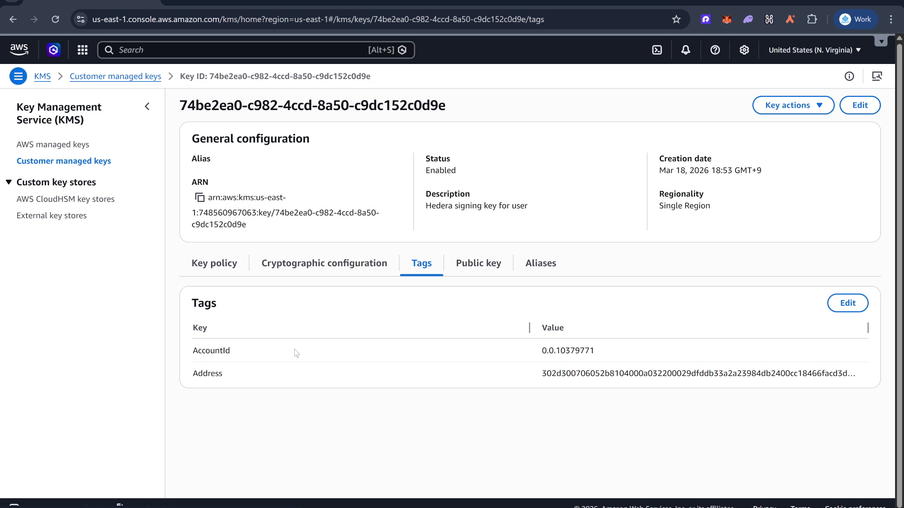

The system supports both native HBAR transfers and any token on the Hedera Token Service (HTS), such as USDC or SAUCE.

### FaceID Payment Experience:

EffiSend allows merchants to seamlessly charge customers using only their biometric identity.

1.  **Initiate Charge**: The merchant enters the requested USD amount into the app.
2.  **Biometric Scan**: The customer’s face is scanned using the device camera to securely verify their identity.

<p align="center">
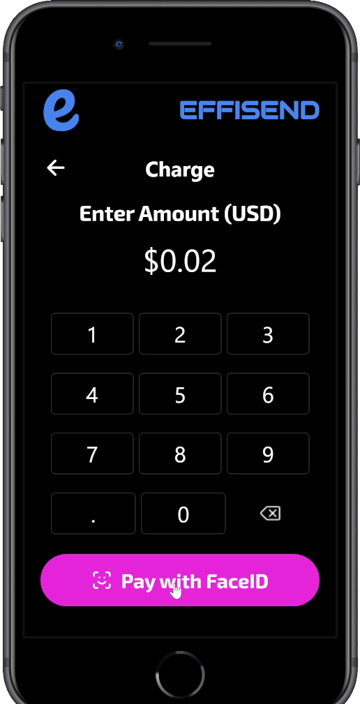 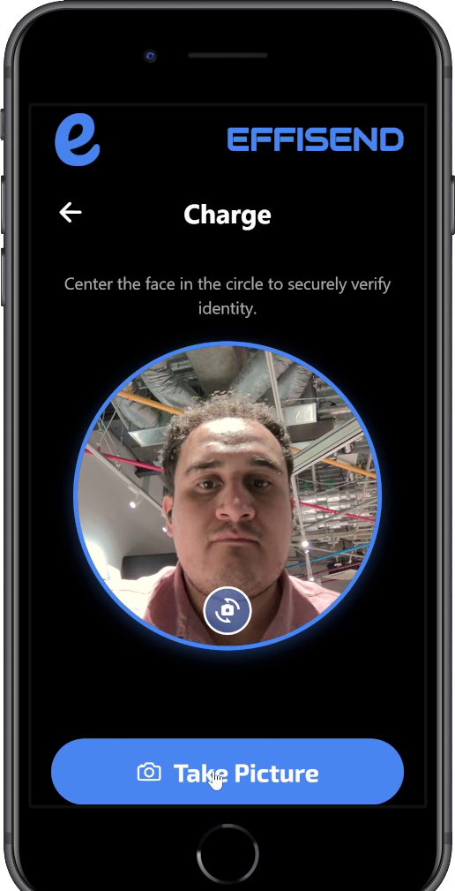 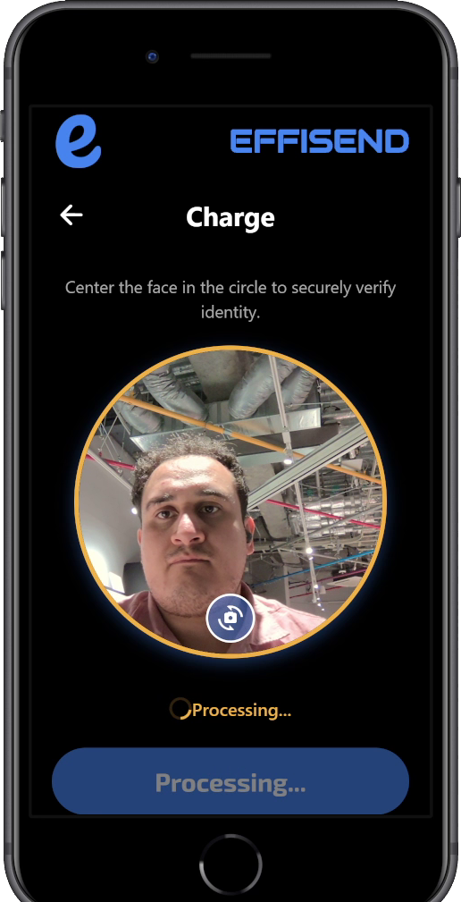
</p>

3.  **Token Selection & Payment**: Upon successful verification, the system fetches the user's available balances and displays supported tokens that have sufficient funds. The user selects their preferred token, and the transaction is routed to the backend for secure KMS signing.

<p align="center">
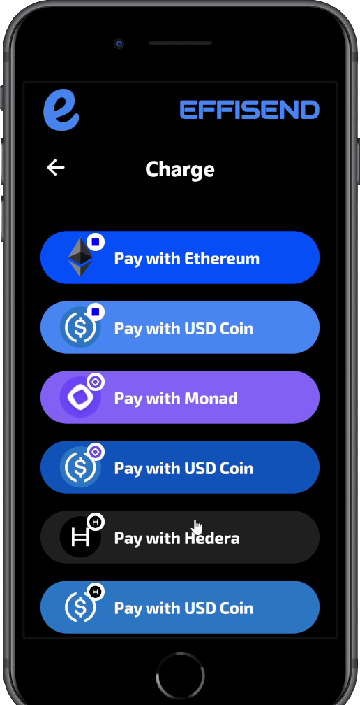 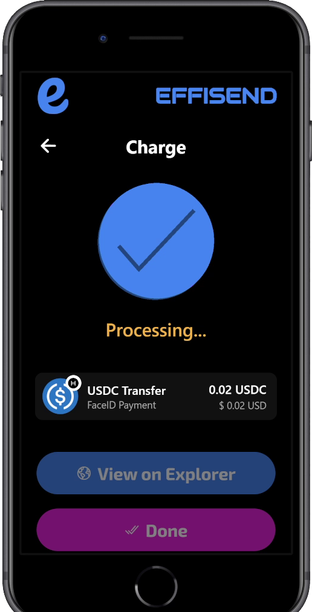 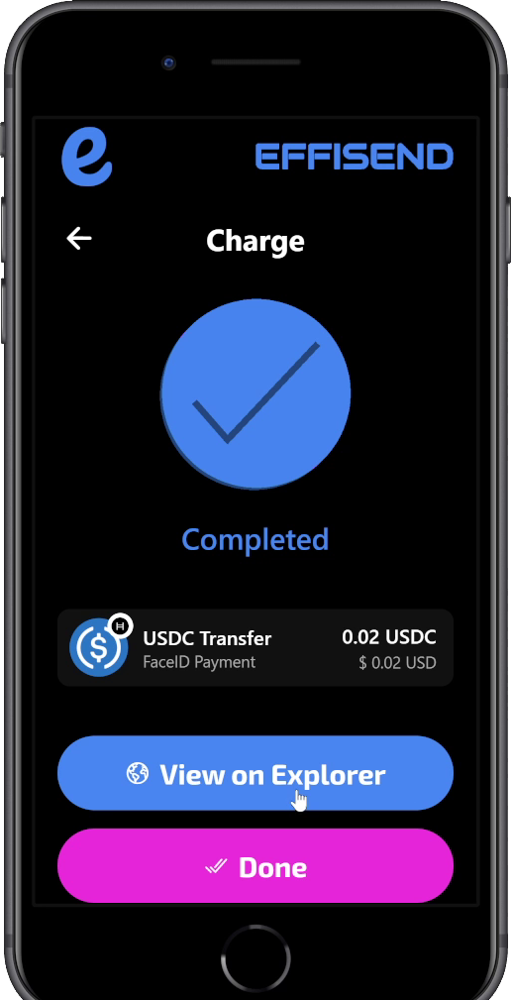
</p>

### Enterprise Signing Workflow:

1.  **Identity Mapping**: The user's biometric "nonce" from AWS Rekognition is mapped to an AWS KMS Key Alias.
2.  **KMS Signing**: The Lambda backend constructs the transaction and sends a digest to KMS. The SignCommand uses the ECDSA\_SHA\_256 algorithm to generate a secure signature.
3.  **DER to Raw Conversion**: Since AWS KMS returns signatures in ASN.1 DER format, EffiSend includes a utility to strip the formatting and return the raw 64-byte signature required by the Hedera network.
4.  **Audit Trail**: Every transaction signed via this method includes a transaction memo: `"Signed by AWS KMS"`, providing a clear on-chain audit log.

<!-- end list -->

```javascript
// hedera.js - Backend Transaction Execution
const kmsSigner = async (message) => {
    const digestHex = keccak256(message);
    const digestBytes = Buffer.from(digestHex.slice(2), 'hex');

    const signCommand = new SignCommand({
        KeyId: kmsKeyAlias,
        Message: digestBytes,
        MessageType: "DIGEST",
        SigningAlgorithm: "ECDSA_SHA_256"
    });
    const signResponse = await kmsClient.send(signCommand);
    // Convert DER signature to raw 64-byte format for Hedera
    return extractRawSignatureFromDER(Buffer.from(signResponse.Signature));
};

// Configure the Hedera Client to use the KMS Signer
client.setOperatorWith(hederaAccountId, kmsPublicKey, kmsSigner);

// Execute HTS or Hbar Transfer
const transaction = new TransferTransaction()
    .addTokenTransfer(tokenId, senderId, -atomicAmount)
    .addTokenTransfer(to, atomicAmount)
    .setTransactionMemo("Signed by AWS KMS");

const txResponse = await transaction.execute(client);
```

All the technical details can be found here:

  - [Transaction Lambda Code](./amazonkms/transaction.js)
  - [Hedera Signing Code](./amazonkms/signing.js)

## 🤖 AI Agent (DeSmond)

The EffiSend platform features DeSmond, a sophisticated, multilingual AI concierge built with LangChain. DeSmond acts as a bridge between natural language and complex on-chain/off-chain operations, allowing users to manage their finances and navigate the Tokyo Dome City ecosystem through simple conversation.

<p align="center">
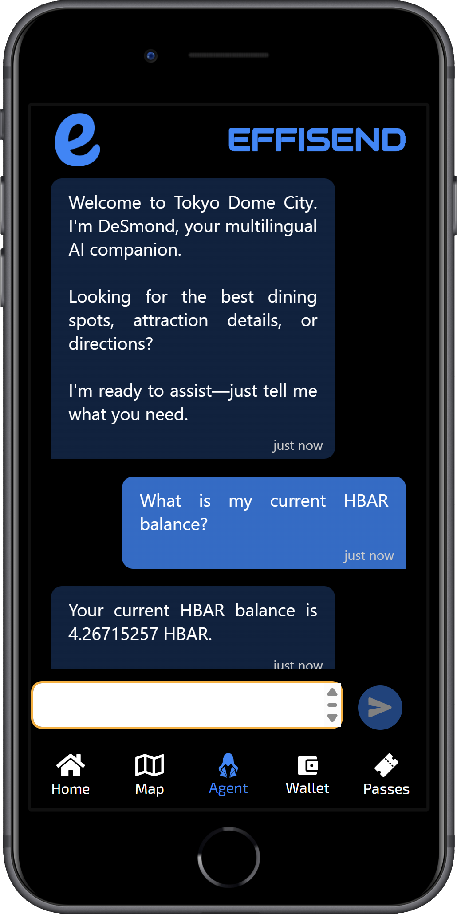 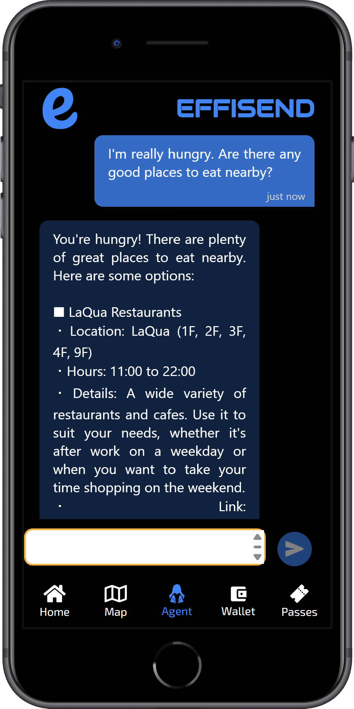
</p>

### Core Architecture & Tech Stack:

DeSmond is powered by Meta Llama 4 (Maverick) via AWS Bedrock, utilizing a serverless architecture designed for high availability and low latency.

  - **LLM**: `us.meta.llama4-maverick-17b-instruct-v1:0`
  - **Context Management**: Features a specialized system injection that enforces "Absolute Truth" regarding connected wallets (Hedera, EVM, Solana, Starknet) to prevent spoofing.
  - **Multilingual Support**: Equipped with a localized error-handling framework capable of communicating in over 20 languages, from Japanese and Korean to Spanish and Arabic.

### Agent Tools & Capabilities:

DeSmond uses native tool-calling to execute real-time logic. Its capabilities are split into two primary domains:

#### 🏛️ Tokyo Dome City Concierge:

  - `get_tokyo_dome_info`: Searches the official directory for food, shops, spas, and facilities.
  - `get_tokyo_dome_events`: Fetches the LIVE Tokyo Dome schedule for concerts, baseball games, and special events.
  - `calculate_distance`: Computes walking distances and times between locations or finds the nearest train station.
  - `get_service_info`: Provides immediate procedures for Lost and Found, First Aid, and Security assistance.

#### 💳 Financial & Crypto Operations:

  - `transfer_tokens`: Facilitates Hbar and HTS token transfers on the Hedera Mainnet.
  - `get_balance_hedera`: Retrieves real-time token balances across all associated HTS accounts.
  - `fund_metamask_card`: A specialized bridge tool that swaps USDC (Hedera) to USDC (Linea) to top up a user's MetaMask Card.

#### 🔄 Cross-Chain Funding: Hedera to Linea:

A unique feature of DeSmond is the ability to bridge liquidity. When a user requests to fund their MetaMask Card, the agent triggers a two-step process: it executes a transfer on Hedera via HTS and simultaneously triggers a contract interaction on Linea to release funds to the card.

```javascript
const transaction = await new TransferTransaction()
    .addTokenTransfer("0.0.456858", accountId, -amount * Math.pow(10, 6)) // USDC HTS
    .addTokenTransfer("0.0.456858", cloudAccountId, amount * Math.pow(10, 6))
    .freezeWith(client);

const signTx = await transaction.sign(privateKey);
const txResponse = await signTx.execute(client);

// Bridge to Linea
const transactionLinea = await contract.transfer(to, parseUnits(amount, 6));
await transactionLinea.wait();
```

All the technical details can be found here:

  - [DeSmond Code](./agent/agent.js)

## 🎫 On-Chain NFT Passes & POAPs

EffiSend transforms digital ticketing and event participation into a seamless on-chain experience. By leveraging the Hedera Token Service (HTS), the platform manages digital passes and POAPs (Proof of Attendance Protocols) that users can collect within the Tokyo Dome City ecosystem.

<p align="center">
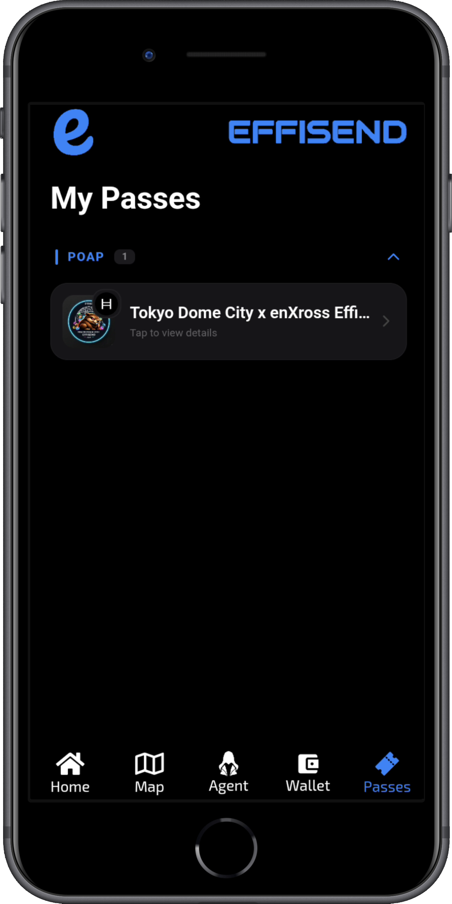 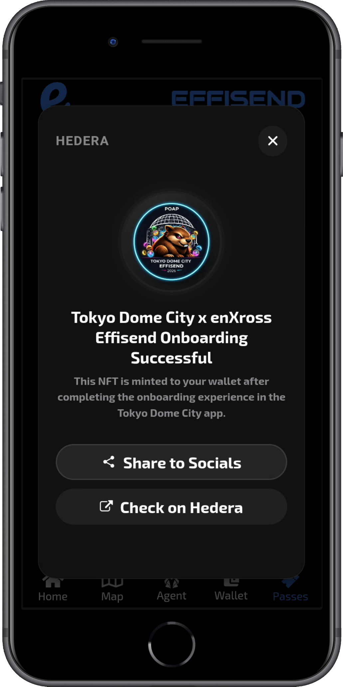 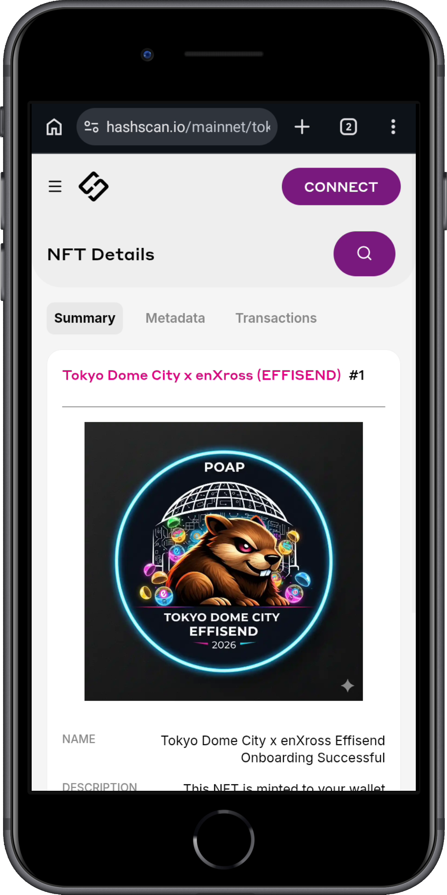
</p>

These passes are more than just images; they are verifiable assets that live on the Hedera Mainnet, providing users with a permanent record of their visits and exclusive access to gated areas or rewards.

### How It Works: The NFT Lifecycle

The system is split into a robust retrieval engine on the frontend and an automated distribution engine on the backend.

1.  **Real-Time Discovery (Mirror Node Integration)**
    Instead of relying on heavy third-party indexers, EffiSend queries the Hedera Mirror Node directly to scan a user's account for specific collections. The frontend processes raw on-chain data, including decoding Base64 metadata and resolving IPFS content to display high-fidelity visuals.

<!-- end list -->

  - **Direct Querying**: Fetches NFT serial numbers and metadata directly from the `/api/v1/accounts/{id}/nfts` endpoint.
  - **Metadata Resolution**: Automatically converts `ipfs://` links to public gateways (like IPFS.io) to ensure images load instantly in the mobile UI.
  - **Multichain Support**: While optimized for Hedera, the engine also tracks passes on EVM-compatible networks (like Monad/Chain 143) using specialized chain adapters.

<!-- end list -->

2.  **Automated Airdrops (TokenAirdropTransaction)**
    To ensure a frictionless user experience, EffiSend utilizes the native Hedera Token Airdrop feature. This allows the system to send passes to users even if they haven't manually "associated" the token yet, significantly reducing the barrier to entry for non-crypto-native users.

<!-- end list -->

  - **Cloud Wallet Management**: An automated backend (AWS Lambda) monitors a central "Cloud Wallet" for available serial numbers.
  - **Ownership Verification**: Before sending, the system checks the Mirror Node to ensure the user doesn't already own the specific pass, preventing double-claims.
  - **Atomic Delivery**: Uses the `TokenAirdropTransaction` to securely transfer the asset from the operator to the receiver with a single on-chain execution.

### Technical Implementation Snippets:

**Frontend: Resolving Hedera NFT Metadata**

```javascript
// Fetching and parsing NFT metadata from Mirror Node (tab5.js)
let metadataUrl = decodeBase64(nft.metadata);
if (metadataUrl.startsWith("ipfs://")) {
    metadataUrl = metadataUrl.replace("ipfs://", "https://ipfs.io/ipfs/");
}
const metaRes = await fetch(metadataUrl);
const metaJSON = await metaRes.json();

return {
    ...metaJSON,
    tokenId: nft.serial_number,
    contract: nft.token_id,
    chain: "hedera"
};
```

**Backend: Executing the Airdrop**

```javascript
// Creating the Airdrop Transaction (index.mjs)
const airdropTx = await new TokenAirdropTransaction()
  .addNftTransfer(MY_TOKEN_ID, serialToSend, operatorId, receiverAccount)
  .setMaxTransactionFee(new Hbar(2))
  .freezeWith(client);

const signedTx = await airdropTx.sign(operatorKey);
const txResponse = await signedTx.execute(client);
const receipt = await txResponse.getReceipt(client);
```

All the technical details can be found here:

  - [NFT & Passes Code](./effisend-hedera/src/app/(screens)/tabs/tab5.js)

## 🎟️ Try It Now: Claim Your Exclusive NFT Pass!

Ready to experience the future of digital ticketing? You can test the automated Hedera Token Airdrop flow right now and mint a special Tokyo Dome City POAP directly to your new wallet.

**1. Create Your Seedless Wallet**
Launch the EffiSend app and complete the quick **Face-ID** onboarding to instantly generate your secure, biometric-linked Hedera account.

<p align="center">
  
</p>

**2. Access the Claim Portal**
Depending on your onboarded device, navigate to our dedicated NFT claim page:

  * 🖥️ **Desktop:** Visit [Claim Page](https://effisend-tdc.expo.app/claimnft)

  * 📱 **Mobile:** Scan the QR code below with your phone's camera:

    

**3. Receive Your Airdrop**
Click the **"Claim NFT"** button. Behind the scenes, our serverless backend verifies your account and executes a native `TokenAirdropTransaction` on the Hedera Mainnet to deliver your asset instantly.

**4. View Your Pass**
Open the **Passes** tab in the EffiSend app. Your new digital pass will be waiting for you, fetched in real-time via the Hedera Mirror Node!