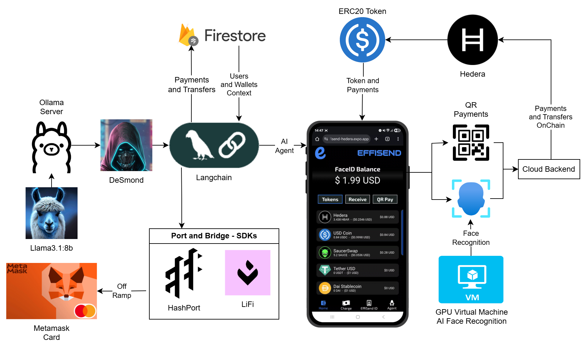

# EffiSend-Hedera

<p align="center">

<p>

EffiSend is a cutting-edge identity and payments platform built on **Hedera**. It combines AI-powered **Face-ID** biometrics with an AI-driven agent for secure, seamless identity and finance management. By tokenizing verified interactions and ecosystem participation, EffiSend bridges trust, finance, and incentives—unlocking a new era of user engagement and rewards.

## 🔗 Fast Links

  - **APP CODE:** [CODE](./effisend-hedera/)
  - **WEB DAPP:** [LINK](https://effisend-hedera.expo.app/)
  - **VIDEO DEMO:** [LINK](pending...)


## ⚙️ System Architecture & Tech Stack

EffiSend is built from the ground up to leverage a modern Web3 infrastructure, ensuring scalability, security, and a seamless user experience.



*(The system diagram illustrates how the EffiSend frontend and backend services interact with the Hedera network via its native services like HTS and HCS. The SAUCE and USDC tokens are shown as the primary assets for rewards and payments.)*

### Core Components:

  - [**Hedera**](https://hedera.com/)
    Serves as the core distributed ledger powering all EffiSend transactions. Hedera's hashgraph consensus provides unparalleled speed, low-cost transactions, and fast finality, making it the ideal foundation for a high-throughput application like EffiSend.

  - [**SAUCE**](https://www.saucerswap.finance/)
    The primary token for **rewards** within the EffiSend ecosystem. As the main utility token of SaucerSwap, the leading DEX on Hedera, SAUCE is deeply integrated into the community, driving user engagement.

  - [**Langchain (AI Agent)**](https://lanchain.com/)
    The framework behind our AI agent, **DeSmond**. It enables natural language processing, allowing users to execute transfers, check balances, and perform other actions through simple conversation.

  - [**DeepFace**](https://viso.ai/computer-vision/deepface/)
    Powers our **Face-ID** verification system. DeepFace provides real-time facial recognition with anti-spoofing features, ensuring that wallet access and transactions are both frictionless and highly secure.

-----

## 💳 Payments

For payments, EffiSend defaults to **USDC** to provide users with a stable and reliable medium of exchange. As a widely adopted stablecoin on Hedera, USDC enables straightforward and cost-effective transactions.

  

#### Crypto Payment Main Code

```javascript
const { PrivateKey, TransferTransaction, Client } = require("@hashgraph/sdk");

// ...

let query = await Accounts.where("user", "==", req.body.user).get();
if (query.empty) {
    throw "BAD USER";
}
const { hederaAccountId, hederaPrivateKey } = query.docs[0].data();

const client = Client.forMainnet().setOperator(hederaAccountId, hederaPrivateKey);

const transferTransaction = await new TransferTransaction()
    .addTokenTransfer(USDC_TOKEN_ID, hederaAccountId, -req.body.amount) // Using USDC for the transfer
    .addTokenTransfer(USDC_TOKEN_ID, req.body.to, req.body.amount)
    .freezeWith(client);

const signTx = await transferTransaction.sign(PrivateKey.fromString(hederaPrivateKey));
const txResponse = await signTx.execute(client);
const receipt = await txResponse.getReceipt(client);

console.log({ hash: txResponse.transactionId.toString() });
res.send({
    error: null,
    res: {
        hash: txResponse.transactionId.toString()
    }
});
```

Making a payment with a token on Hedera is simple. This interface facilitates all payment requests, which are authorized via successful **Face-ID** verification or a **QR code scan** (similar to Alipay). While this example uses USDC, our system supports payments with any HTS-compatible token.

-----

## 🎁 Rewards

EffiSend’s identity-based rewards model encourages platform engagement. Users earn **SAUCE** tokens for completing a certain number of transactions or actions, fostering a vibrant and active community. We leverage Hedera's native **Hedera Token Service (HTS)** for all reward distributions, avoiding the need for a custom smart contract.

Our **Trust Score** algorithm is based on a user's on-chain activity. By analyzing an account's transaction history on Hedera, we can reward active and trustworthy users, which in turn unlocks better recommendations and future rewards.

#### New Account Reward Snippet

```javascript
// ...

// Create a new account on Hedera
const newPrivateKey = PrivateKey.generateED25519();
const newPublicKey = newPrivateKey.publicKey;
const newAccountTx = await new AccountCreateTransaction()
    .setKey(newPublicKey)
    .setInitialBalance(new Hbar(0))
    .execute(client);

const getReceipt = await newAccountTx.getReceipt(client);
const newAccountId = getReceipt.accountId;

// ...

// Send Rewards in SAUCE
const sendSauceTx = await new TransferTransaction()
    .addTokenTransfer(SAUCE_TOKEN_ID, DISTRIBUTOR_ACCOUNT_ID, -10) // 10 SAUCE
    .addTokenTransfer(SAUCE_TOKEN_ID, newAccountId, 10)
    .execute(client);

const receipt = await sendSauceTx.getReceipt(client);
console.log({ tx_rewards: sendSauceTx.transactionId.toString() });
```

This native token system is highly efficient and secure, leveraging Hedera's core features to manage rewards without the overhead of custom logic.

-----

## 🤳 FaceID Payments

EffiSend enables seamless and secure payments through facial recognition, linking a user’s unique biometric profile directly to their wallet.

  

The core of this feature is a two-part validation process:

1.  **`fetchOrSave`:** This function first attempts to find an existing user via facial recognition. If no match is found, it securely saves the new user's facial embedding, linking it to their new account.
2.  **`fetch`:** This function is used for subsequent logins and transaction authorizations, performing a search-only operation to retrieve user data upon a successful facial match.

This biometric system is isolated from other services to ensure maximum security.

#### User Verification Snippet

```python
@app.post("/fetchOrSave", dependencies=[Depends(check_api_key)])
async def findUser(item: ItemUserFace):
    # This function processes the image to find a match in the database.
    # If a match is found, it returns the user's ID.
    # If not, it saves the new face embedding linked to a new user nonce.
    try:
        result = DeepFace.find(
            img_path=item.image,
            db_path=DB_DIR,
            anti_spoofing=True
        )
        # Simplified result parsing
        return {"result": result[0].identity[0]}
    except Exception:
        # Save new user image
        save_image(item.image, item.nonce)
        return {"result": True}
```

-----

## 🤖 AI Agent (DeSmond)

The EffiSend platform features **DeSmond**, an AI agent built with **Langchain**. DeSmond understands natural language, allowing users to manage their finances conversationally.

 

### Agent Tools & Capabilities

DeSmond uses a graph-based workflow to conditionally execute tasks based on user intent. Its primary tools include:

  - **`transfer_tokens`**: Facilitates token transfers on the Hedera Mainnet.
  - **`get_balance_hedera`**: Retrieves a user's current token balance on Hedera.
  - **`web_search`**: Performs internet searches to answer general knowledge questions.
  - **`list_of_tools`**: Informs the user about DeSmond's capabilities.
  - **`fallback`**: Provides a friendly, conversational response when a user's intent is unclear.

#### Tool Example: `transfer_tokens`

```javascript
const transferTokens = tool(
    async ({ amount, to, token }, { configurable: { user } }) => {
        // Calls the internal API to execute the HTS transfer
        const response = await fetchURL(process.env.EXECUTE_PAYMENT_API, {
            user,
            amount,
            id: tokens.findIndex((t) => t.symbol === token),
            to,
        });

        if (!response || response.error) {
            return JSON.stringify({ status: "error", message: "Transaction failed." });
        }

        const { hash } = response;
        return JSON.stringify({
            status: "success",
            message: `Transaction sent! View on Hedera Mainnet.`,
            transaction: hash,
        });
    },
    {
        name: "transfer_tokens",
        description: `Transfers tokens on the Hedera Mainnet. Activates when a user asks to send or transfer funds. Available tokens: ${tokens.map(t => t.symbol).join(", ")}.`,
        schema: z.object({
            amount: z.string(),
            to: z.string(),
            token: z.string(),
        }),
    }
);
```